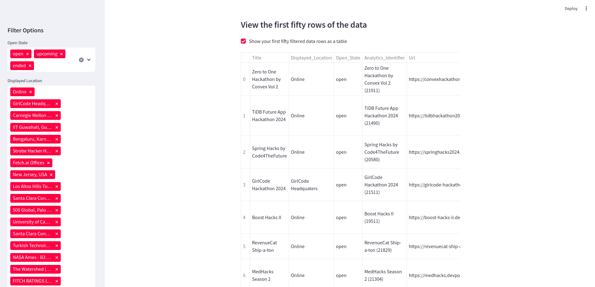

# live-hackathon-scraper-with-beautiful-soup-and-dashboard-with-streamlit
live hackathon scraper with beautiful soup and dashboard with streamlit
# Hackathons Dashboard

## Deploy Streamlit App with SQLite Integration

### Deployed Streamlit App

## Link: [Hackathons Dashboard](https://your-app-name.streamlit.app)

## Project Description

#### I developed an interactive web application to display hackathons data. This project scrapes hackathon information from a public API and presents it through a Streamlit dashboard. The application integrates SQLite for data storage and Plotly Express for visualizing data.

## Key Features:

#### Data Scraping: Utilized requests to fetch hackathon data from a public API and stored it in a SQLite database.
#### Interactive Dashboard: Created a Streamlit dashboard allowing users to filter and view hackathons based on their state, location, and themes.
#### Apply Links: Displayed links for applying to open and upcoming hackathons directly from the dashboard.
#### Data Visualization: Incorporated Plotly Express to create pie charts and histograms for visualizing hackathon statistics and distributions.
#### Automatic Data Update: Implemented APScheduler to automatically scrape and update hackathon data daily.

## Technologies Used:

#### Python
#### Streamlit
#### Plotly Express
#### SQLite
#### APScheduler
#### Requests

## Benefits:

#### Provides real-time hackathon information with automatic daily updates.
#### Features a user-friendly interface for easy filtering and viewing of hackathons.
#### Includes interactive visualizations to help users understand data distributions and statistics.
#### Allows users to apply for hackathons directly through the dashboard.

## Project Status:

#### The project is fully functional and deployed. It continuously scrapes and updates hackathon data, offering an intuitive dashboard for users to explore and apply for hackathons. Find the deployed app at: [Hackathons Dashboard](https://your-app-name.streamlit.app)

## Looking For:

#### Opportunities to collaborate on similar projects, customize the dashboard for specific needs, or provide ongoing maintenance and support.

# APPLICATION VIEW

## Code Concerned for This View: `hackathons_dashboard.py`
